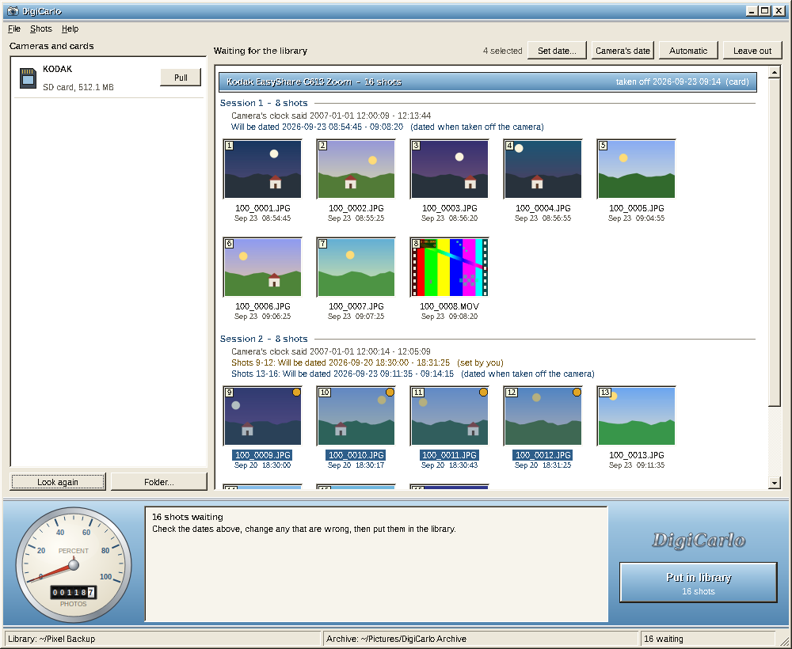

# DigiCarlo

[](https://github.com/AntAir267/DigiCarlo/actions/workflows/tests.yml)


Gets the pictures off old digital cameras, with dates that are right.

Every camera DigiCarlo is meant for has a clock that is wrong. A Kodak
EasyShare resets to 2007-01-01 12:00 whenever its batteries come out; a C315
goes back to 2005, a Polaroid PDC1300 to 2000; several cannot be set to 2026
at all. Put their pictures in a photo library and they land years in the
past.

So DigiCarlo dates pictures by **when they came off the camera**, and keeps
the one thing such a clock still gets right: the gaps between shots. Any run
of shots can be given a date of its own instead.



## Install

```bash
./packaging/build-deb.sh
sudo apt install ./packaging/digicarlo_1.0.0-1_all.deb
```

That brings in what it needs — `exiftool` to write dates, `ffmpeg` to remux
clips, `udisks2` to mount cards — and recommends PyQt6 for the window,
`python3-usb` for the SiPix Blink II and `gphoto2` for PTP cameras. It adds a
udev rule so the Blink II works without root, a menu entry, a KDE device
notifier action ("Import pictures with DigiCarlo"), man pages and bash
completion.

Later releases can be fetched with `digicarlo update --install`, which checks
the download against the release's published `SHA256SUMS` before handing it
to apt.

To run from the source tree instead: `./digicarlo-dev` for the command,
`./digicarlo-dev gui` for the window.

## Where things go

DigiCarlo keeps two folders, set with **File > Folders** or `digicarlo config`:

- **The archive** (`~/Pictures/DigiCarlo Archive`): the camera's files byte
  for byte, one folder per pull, under their card paths. Each copy is read
  back and compared before it counts. Nothing here is ever changed, and
  everything in the library can be rebuilt from it.
- **The library** (`~/Pictures/DigiCarlo` by default — a synced folder such as
  a phone backup is what it is for): re-dated copies, flat, under the
  camera's own file names.

Keep the archive out of anything that syncs, or every photo arrives twice.

`manifest.jsonl` in the archive records what arrived, what the camera's clock
said, and what was made of it. It is append-only JSON lines: a crash costs at
most the line being written.

A file already archived is recognised by content (its size and a hash of its
first and last 64 KiB), so it is not pulled twice even after renaming. To keep
a library filled before DigiCarlo from getting second copies:

```bash
digicarlo remember ~/"Pixel Backup"
```

## Dates

A **session** is a run of shots over which the camera's clock ran unbroken.
A new one starts where the clock goes backwards — a battery swap resetting it
— or leaps forward more than 30 days, which is the clock being set rather than
the camera sitting in a drawer. Shooting order comes from the DCF file
numbers, which a reset cannot disturb.

By default a pull's **last shot is dated when it came off the camera**. The
rest of its session keeps the camera's gaps back from there. Earlier sessions
are stacked before it a minute apart, because how long really passed between
two sessions is exactly what a reset destroys. Shots stamped in the same
second are nudged a second apart so their order survives into a library that
sorts by date.

Any group of shots can instead:

- **start at a date you give** — the rest follow with the camera's gaps, and
  successive sessions follow each other;
- **keep the camera's own date**, for the rare camera whose clock is right;
- go back to **automatic**.

Overriding some shots never moves the ones around them. In the window, select
shots (click a session's heading to take all of it) and use **Set date**,
**Camera's date** or **Automatic**. On the command line:

```bash
digicarlo plan                                   # sessions, and the dates they get
digicarlo import --date S2="2026-09-12 19:00"    # session 2 starts then
digicarlo import --date 12-30="yesterday 18:00"  # shots 12 to 30
digicarlo import --date "2026-09-12"             # everything, from noon that day
digicarlo import --date S3=camera                # keep the camera's dates
```

Stills get EXIF `DateTimeOriginal`, `CreateDate` and `ModifyDate` with the UTC
offset alongside; clips get QuickTime creation dates (UTC, as the format
specifies) and `Keys:CreationDate` in local time; every file's modification
time is set too, since some galleries fall back on it.

Where the camera's clock comes from: EXIF for stills, the QuickTime or AVI
header for clips, and otherwise the file's time on the card. FAT stores that
without a time zone and Linux presents it as UTC, so DigiCarlo compares it
with the EXIF times on the same card and corrects for any difference.

## Clips

MOV, AVI and MTS clips become MP4. The **video stream is copied bit for bit**,
never re-encoded, and checked afterwards by hashing it in both files. Only
audio MP4 cannot carry is converted: the Kodaks record 8-bit PCM, which has
no MP4 codec tag, so it becomes AAC at 128 kbit/s — comfortably more than an
11 kHz 8-bit source holds.

The video in those Kodak clips is Motion JPEG, which ffmpeg tags `mp4v` in an
MP4. Anything that looks at the bitstream plays it, which is ffmpeg, VLC and
phones. A player that trusts the tag alone would not. The original MOV is
always in the archive.

## Cameras

| Kind | How it is found | How it is read |
| --- | --- | --- |
| Memory card, or a camera in USB-drive mode | `lsblk`; mounted read-only through udisks if the desktop has not mounted it | Copied from `DCIM` (and Sony/Panasonic video folders), skipping `.Trashes` |
| PTP camera | `gphoto2 --auto-detect` | `gphoto2 --get-all-files`, keeping what is new |
| SiPix StyleCam Blink II | USB `0c77:1011` | Blinky's driver: raw bytes to disk first, whole-image retries, 4 KB prefix reads to spot photos already archived |
| Any folder | `--from DIR`, or **Folder...** | As a card |

A card that is failing gives up files one at a time. DigiCarlo reports each
one it cannot read and carries on with the rest; nothing that failed is
recorded, so the next pull tries it again.

Camera raw files (ARW, CR2, NEF, ...) stay in the archive when the camera also
wrote a JPEG of the same shot, and go to the library otherwise.

### The SiPix Blink II

The Blink II is driven by [Blinky](https://github.com/AntAir267/blinky),
included here as `digicarlo/blinky.py` — an unmodified copy, with its commit
recorded in `digicarlo/BLINKY_SOURCE`. DigiCarlo uses it as a library; it
does not need the Blinky package installed and does not conflict with it.
Stills are decoded to 640x480 and saved as JPEG so they can carry EXIF dates
(`digicarlo config set still_format png` for lossless PNG instead), clips as
MP4, and names continue Blinky's `imageNNNN` numbering. The camera has no
clock, so its shots are a second apart in the order it lists them.
`digicarlo doctor` runs Blinky's link checks when the camera is attached.

## The window

`digicarlo-gui` is Windows 95 dressed as a Nash Metropolitan.

From Windows 95: bevelled controls, classic scroll bars and menus (Qt's own
"Windows" style, which is the real Win9x drawing code), Microsoft Sans Serif
at 8 points without anti-aliasing, the caption buttons, the status bar and its
size grip. From the Metropolitan, in moderation: two-tone paint, powder blue
below and Snowberry white above; a chrome beltline under the title bar; the
name in chrome script on the bodywork; and a dashboard with a chrome-bezelled
speedometer showing how far a job has got, its odometer counting every file
DigiCarlo has ever put in the library.

Like Blinky's window, everything is painted rather than themed, and the frame
is drawn by the program, so moving and resizing are handed to the compositor
(`startSystemMove`, `startSystemResize`) — the only way a window may move
itself on Wayland.

Cameras and cards appear on the left as they are plugged in; a camera being
read is left alone until it is done.

## Commands

| Command | What it does |
| --- | --- |
| `digicarlo import` | Pull from everything plugged in, show the dates, and on a yes develop |
| `digicarlo sources` | List cameras and cards |
| `digicarlo pull` | Copy new files into the archive only |
| `digicarlo plan` | Show the sessions and the dates they would get |
| `digicarlo develop` | Put waiting shots in the library |
| `digicarlo skip 3-5` / `unskip` | Leave shots out, or bring them back |
| `digicarlo remember DIR` | Treat what is in DIR as already imported |
| `digicarlo doctor` | Check tools, folders, and what is plugged in |
| `digicarlo config [set KEY VALUE]` | Show or change settings |
| `digicarlo update` | Fetch a newer release |

## Tests

```bash
python3 tests/test_digicarlo.py
```

No camera is needed: cards are folders, the Blink II is Blinky's simulated
camera, and clips are made with ffmpeg. Tests that write dates need exiftool
and are skipped, with a reason, without it.

## Licence

LGPL-2.1-or-later, as Blinky is, since Blinky's protocol work follows
libgphoto2's.
